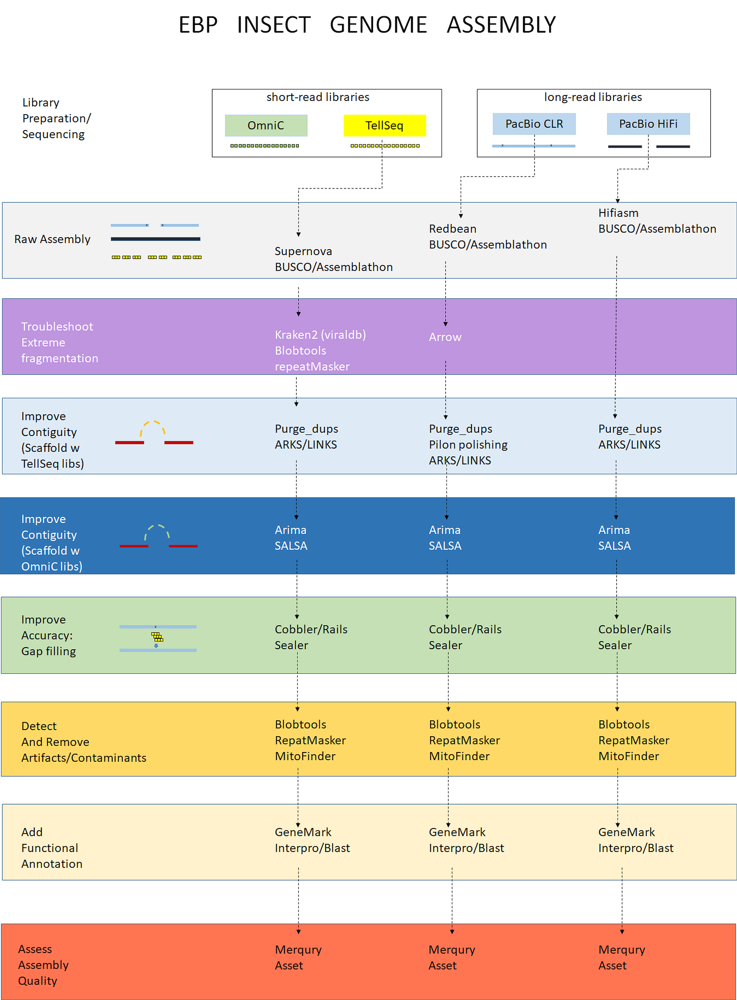

# Earth Biogenome Project (EBP) Insect Genome Assembly

The Illinois Innovation Network and the Discovery Partners Institute funded a pilot project to assemble the genomes of agriculturally relevant insects in Illinois for which little or no genomic data are available. Hiqh-quality DNA was isolated using protocols optimized for small, difficult samples. The pilot project Implemented the novel use of Tell-Seq linked-read libraries for the dual purpose of genome size estimation and linked-read scaffolding. Genomes were assembled using PacBio HiFi reads, Tell-Seq reads, and Dovetail Omni-C reads for chromosome-range scaffolding. 

Eight high-quality genomes were assembled from non-model organisms with contig N50 >1Mb and scaffold N50 >5Mb, including the second-only soon-to-be public genome for the order Neuroptera. Species were confidently identified using the mitochondrial genomes assembled from the HiFi reads. Potential endosymbionts and pathogens were identified as well as novel prey information from predator species. Genomes were annotated using the BRAKER2 pipeline, generating a rich set of novel data to mine

Our sponsors: 

- Illinois Innovation Network https://iin.uillinois.edu/

- Discovery Partners Institute https://dpi.uillinois.edu/

- Carl R. Woese Institute for Genomic Biology (IGB) https://www.igb.illinois.edu

- Roy J. Carver Biotechnology Center https://biotech.illinois.edu/

To learn more about the Earth Biogenome Project, please use this link: https://www.earthbiogenome.org/

# The Workflow

   

# Denovo genome assembly using HiFi reads

These are the steps:

1. generate raw assembly with hifiasm  (see ./scripts/Raw_assembly/ )

2. purge duplicate contigs (see ./scripts/scaffolding )

3. scaffolding using TellSeq reads (see ./scripts/scaffolding )

4. scaffolding using Omni-C reads (see ./scripts/scaffolding )

5. gap filling (see ./scripts/gap_filling_and_masking/ )

6. masking repeats and low complexity regions (see ./scripts/gap_filling_and_masking/ )

7. functional annotation (see ./scripts/Annotation/ )

8. identify and annotate mitochondrial DNA (see ./scripts/mitofinder/ )

9. assess genome completeness w Merqury (see ./scripts/Merqury_completeness/ )

10. identify contaminants and artifacts in genome (see ./scripts/blobtools_contaminants_detection/ )

# Denovo genome assembly using CLR reads

1. generate raw assembly with Redbean  (see ./scripts/Raw_assembly/ )

2. base-correct assembly with Arrow (see ./scripts/Arrow_polish )

3. purge duplicate contigs (see ./scripts/scaffolding )

4. Pilon polishing (see ./scripts/pilon_polishing )

5. scaffolding using TellSeq reads (see ./scripts/scaffolding )

6. scaffolding using Omni-C reads (see ./scripts/scaffolding )

7. gap filling (see ./scripts/gap_filling_and_masking/ )

8. masking repeats and low complexity regions (see ./scripts/gap_filling_and_masking/ )

9. functional annotation (see ./scripts/Annotation/ )

10. FreeBayes polishing (see ./scripts/FreeBayes_polishing )

11. identify and annotate mitochondrial DNA (see ./scripts/mitofinder/ )

12. assess genome completeness w Merqury (see ./scripts/Merqury_completeness/ )

13. identify contaminants and artifacts in genome (see ./scripts/blobtools_contaminants_detection/ )

